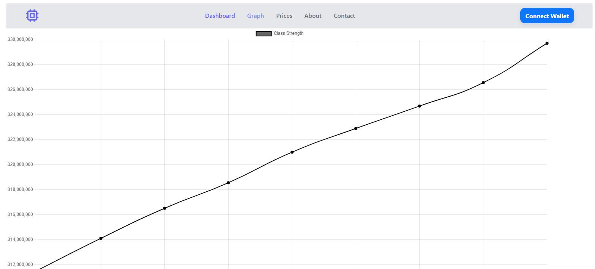
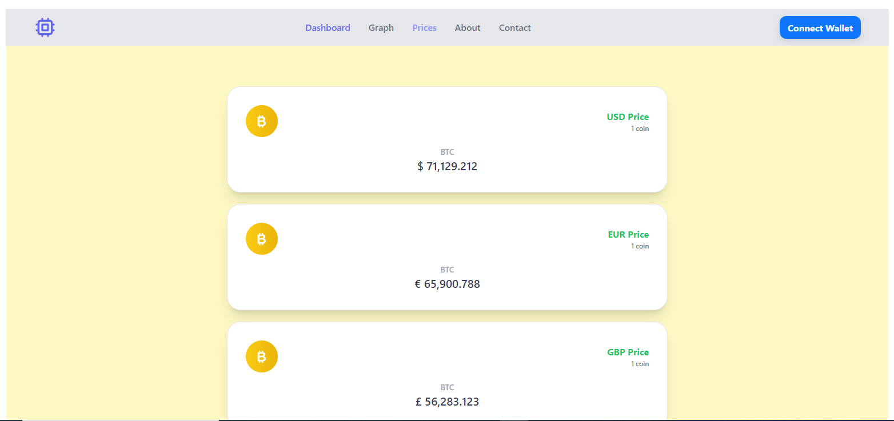
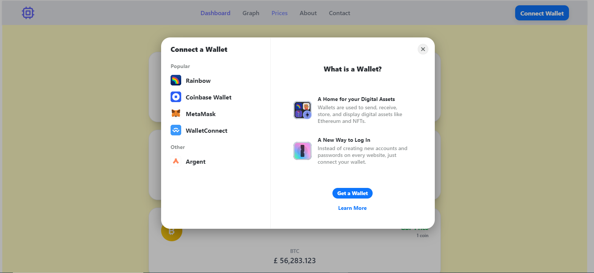
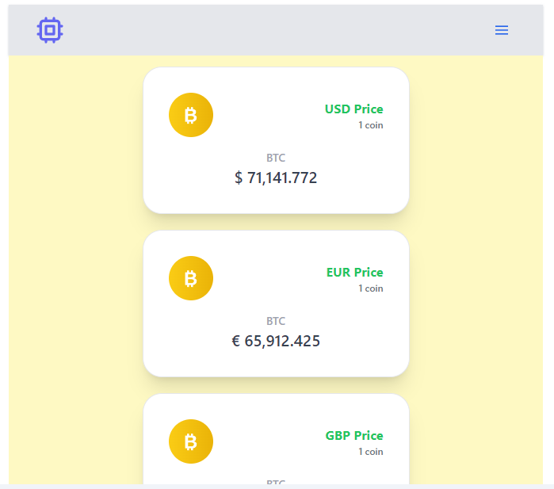
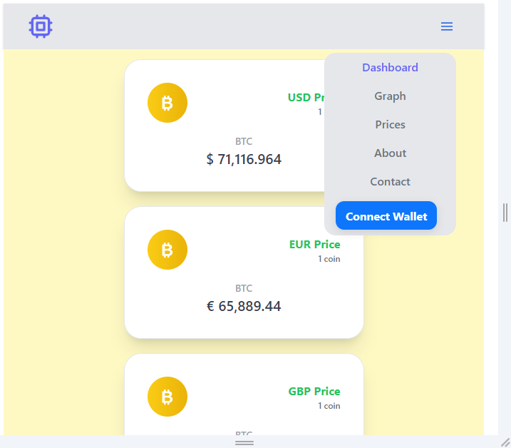

# Requirement

https://docs.google.com/document/d/1PK9PSqu3Rl7yoww3zvCHKqgi-2hrXlEQGUeTsm91WGk/edit?usp=sharing.

# implement
- Display population datas as a Graph

- Display Price Cards

- Wallet Connect using Rainbowkit

- Responsive

